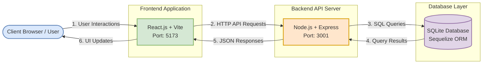
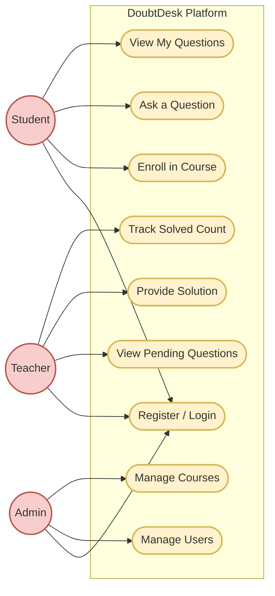

# DoubtDesk Diagrams

You can preview this file directly in VS Code by right-clicking the file tab and selecting **"Open Preview"** (or press `Ctrl+Shift+V`).

## 1. Architecture & Data Flow Diagram

---

## 2. Use Case Diagram

